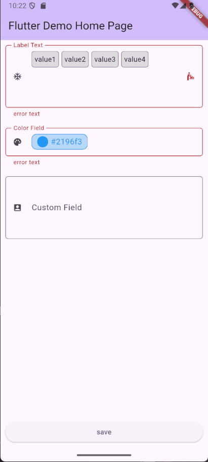

<!--
This README describes the package. If you publish this package to pub.dev,
this README's contents appear on the landing page for your package.
-->
# AnyField

[](https://pub.dev/packages/any_field)  [](https://github.com/semutKecil/any_field/actions/workflows/publish.yml) [](https://saweria.co/hrlns) [](https://ko-fi.com/M4M81N5IYI)

A flexible Flutter input field widget that can display arbitrary content while maintaining the look and feel of a TextField. Particularly well-suited for building custom picker fields that open dialogs for selection (date pickers, color pickers, multi-select, etc.).

[](https://ko-fi.com/M4M81N5IYI)

## How to Contribute

Before diving into the docs, here’s how you can support the plugin:

- 🐞 **Found a bug or have an idea?**  
  Open an issue on [GitHub](https://github.com/semutKecil/any_field/issues)

- 🔧 **Got time to fix it?**  
  Fork the repo and submit a pull request—we’ll review it fast

- 💖 **Want to support the project?**  
  If this plugin makes your life easier, a small donation helps us keep building and improving it for everyone 
  
  [](https://saweria.co/hrlns) [](https://ko-fi.com/M4M81N5IYI)

- 👍 **Like what you see?**  
  Smash the thumbs-up on pub.dev—it helps more devs discover us!

---

## Table of contents

- [AnyField](#anyfield)
  - [How to Contribute](#how-to-contribute)
  - [Table of contents](#table-of-contents)
  - [Demo](#demo)
  - [Perfect for Dialog-based Pickers](#perfect-for-dialog-based-pickers)
  - [Features](#features)
  - [`any_field` Changelog](#any_field-changelog)
    - [v0.1.0 – InputDecorator Refactor \& Alignment Reset](#v010--inputdecorator-refactor--alignment-reset)
      - [✨ Major Changes](#-major-changes)
      - [🧱 Architectural Improvements](#-architectural-improvements)
      - [🧪 Migration Notes](#-migration-notes)
  - [Installation](#installation)
  - [Usage](#usage)
    - [Basic Example](#basic-example)
    - [With Controller](#with-controller)
  - [Usage notes](#usage-notes)
  - [API Reference](#api-reference)
    - [AnyField](#anyfield-1)
    - [AnyValueController](#anyvaluecontroller)
  - [Form Integration](#form-integration)
    - [AnyFormField API](#anyformfield-api)
  - [Additional Information](#additional-information)
  - [Contributing](#contributing)
  - [License](#license)

## Demo

<!-- Use an HTML img tag to constrain the rendered size of the demo GIF -->
<p align="center">
  
</p>

## Perfect for Dialog-based Pickers

AnyField is designed to be the foundation for custom picker widgets that use dialogs or bottom sheets:
- Keep TextField's visual style (labels, borders, icons) while displaying any content
- Built-in tap handling for opening dialogs
- Easy integration with existing picker dialogs (DatePicker, ColorPicker, etc.)
- Support for async operations when selecting values
- Form-enabled wrapper for validation

Common use cases:
- Date/Time pickers with custom formats
- Multi-select fields with chip display
- Color pickers with preview
- Custom dropdown alternatives
- Any picker that needs dialog interaction


## Features

- 📝 Display any custom content within an input field
- 🎨 Full support for InputDecoration (labels, borders, icons)
- 📏 Configurable height constraints with scroll support
- 🔄 Value management through controller pattern
- 🖱️ Tap handling for custom interaction
- ⌨️ Keyboard navigation support

---

## `any_field` Changelog

### v0.1.0 – InputDecorator Refactor & Alignment Reset  
**Released:** November 4, 2025

#### ✨ Major Changes
- **Migrated core layout to `InputDecorator`**  
  Replaced legacy composition with native `InputDecorator` for idiomatic form field rendering and label/hint behavior.

- **Removed all `compensation` and `displayPadding` parameters**  
  Simplified API surface by eliminating manual layout overrides. Alignment now follows native Flutter behavior.

- **Introduced baseline-driven hint alignment strategy**  
  Hint text alignment now respects child baseline. Developers should ensure children provide valid baselines (e.g. `Text`, `Baseline`) for proper vertical centering.

#### 🧱 Architectural Improvements
- Unified field rendering logic across dropdowns, text fields, and custom inputs.
- Improved compatibility with form validation, focus traversal, and accessibility.
- Reduced layout bugs related to padding compensation and vertical drift.

#### 🧪 Migration Notes
- If your field previously relied on `displayPadding` or `compensation`, you may need to adjust child height or wrap in `Baseline` to preserve hint alignment.
- For tall fields (e.g. height ≥ 100), use `Text(' ')` or `Baseline` inside `InputDecorator` to center hint text.

---

## Installation

Add this to your package's `pubspec.yaml` file:

```yaml
dependencies:
  any_field: ^0.1.1
```

## Usage

### Basic Example

```dart
AnyField<List<String>>(
  displayBuilder: (context, tags) => Wrap(
    spacing: 4,
    children: tags.map((tag) => Chip(label: Text(tag))).toList(),
  ),
  controller: AnyValueController(['flutter', 'widget']),
  decoration: InputDecoration(
    labelText: 'Tags',
    border: OutlineInputBorder(),
  ),
  onTap: (current) => _showTagSelector(),
)
```

### With Controller

```dart
final controller = AnyValueController<DateTime>(
  DateTime.now(),
  shouldNotify: (prev, curr) => prev.day != curr.day,
);

AnyField<DateTime>(
  displayBuilder: (context, date) => Text(
    DateFormat.yMMMd().format(date),
  ),
  controller: controller,
  decoration: InputDecoration(
    labelText: 'Date',
    suffixIcon: Icon(Icons.calendar_today),
  ),
  onTap: (current) async {
    final date = await showDatePicker(...);
    if (date != null) controller.value = date;
  },
)
```

## Usage notes

To maintain consistent vertical spacing and alignment, `AnyField` sets `InputDecoration.isDense = true` by default. This affects the layout of prefix/suffix icons:

- **If you're using `prefixIcon` or `suffixIcon`**, make sure to set their size to `24.0` to match the default `TextField` appearance.

```dart
InputDecoration(
  labelText: 'Example',
  prefixIcon: Icon(Icons.tag, size: 24), // Match TextField default
)
```

This ensures your icons align properly with the text and hint, especially when using custom widgets or tall content inside `AnyField`.


- AnyField `onTap` accepts `FutureOr<void>` handlers. For AnyField the callback should update the controller (the return value is ignored). Example:
```dart
AnyField<DateTime>(
  displayBuilder: (c, date) => Text(date == null ? 'Pick a date' : DateFormat.yMMMd().format(date)),
  controller: controller,
  onTap: (current) async {
    final picked = await showDatePicker(...);
    if (picked != null) controller.value = picked;
  },
)
```

- AnyField is well suited for building picker UI that opens dialogs (date picker, selection dialogs, color pickers, etc.). Use the `onTap` callback to open your dialog and update the controller when the user selects a value.

## API Reference

### AnyField

| Parameter | Type | Description |
|-----------|------|-------------|
| `displayBuilder` | `Widget Function(BuildContext, T)` | Builds the content display |
| `decoration` | `InputDecoration` | Standard input decoration |
| `minHeight` | `double?` | Minimum field height |
| `maxHeight` | `double?` | Maximum field height |
| `controller` | `AnyValueController<T>?` | Value controller |
| `onChanged` | `ValueChanged<T?>?` | Value change callback |
| `onTap` | `FutureOr<void> Function(T? value)?` | Tap handler (sync or async). Handler should update controller; return value is ignored. |

### AnyValueController

Controller for managing field values.

```dart
// Create with initial value
final controller = AnyValueController<int>(42);

// Create empty
final controller = AnyValueController<String>.empty();

// With custom change detection
final controller = AnyValueController<List>(
  [],
  shouldNotify: (prev, curr) => prev.length != curr.length,
);
```

## Form Integration

AnyField can be used within forms using the `AnyFormField` wrapper. Note: `AnyFormField.onTap` uses the same signature as `AnyField` (`FutureOr<void> Function(T? value)?`) — the callback should update the controller or call `onChanged` to apply the selected value.

```dart
final controller = AnyValueController<DateTime?>(null);

Form(
  key: _formKey,
  child: Column(
    children: [
      AnyFormField<DateTime?>(
        controller: controller,
        displayBuilder: (context, date) => 
          Text(date == null ? 'Pick a date' : DateFormat.yMMMd().format(date)),
        decoration: InputDecoration(
          labelText: 'Event Date',
          suffixIcon: Icon(Icons.calendar_today),
        ),
        validator: (value) {
          if (value == null) return 'Please select a date';
          if (value!.isBefore(DateTime.now())) {
            return 'Date must be in the future';
          }
          return null;
        },
        onSaved: (value) => _eventDate = value,
        onTap: (currentDate) async {
          final date = await showDatePicker(
            context: context,
            initialDate: currentDate ?? DateTime.now(),
            firstDate: DateTime.now(),
            lastDate: DateTime(2025),
          );
          if (date != null) {
            controller.value = date;
          }
        },
      ),
      ElevatedButton(
        onPressed: () {
          if (_formKey.currentState!.validate()) {
            _formKey.currentState!.save();
            // Handle saved data
          }
        },
        child: Text('Submit'),
      ),
    ],
  ),
)
```

### AnyFormField API

| Parameter | Type | Description |
|-----------|------|-------------|
| `displayBuilder` | `Widget Function(BuildContext, T)` | Builds the content display |
| `decoration` | `InputDecoration` | Input decoration (shows validation errors) |
| `minHeight` | `double?` | Minimum field height |
| `maxHeight` | `double?` | Maximum field height |
| `initialValue` | `T?` | Initial value when no controller provided |
| `controller` | `AnyValueController<T>?` | Optional external controller |
| `validator` | `FormFieldValidator<T>?` | Form validation function |
| `onSaved` | `FormFieldSetter<T>?` | Called when form is saved |
| `onChanged` | `ValueChanged<T?>?` | Value change callback |
| `onTap` | `FutureOr<void> Function(T? value)?` | Tap handler (sync or async). Handler should update controller or call onChanged. |

## Additional Information

- Works with any value type through generics
- Supports keyboard focus and navigation
- Automatically handles scroll when content exceeds maxHeight
- Compatible with Form widgets and validation

## Contributing

Contributions are welcome! If you have ideas, bug reports, or feature requests, feel free to open an issue or pull request. See [CONTRIBUTING.md](CONTRIBUTING.md) for guidelines.

## License

MIT License - see the [LICENSE](LICENSE) file for details
